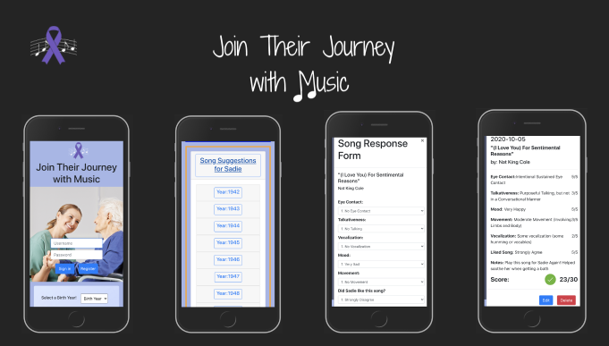
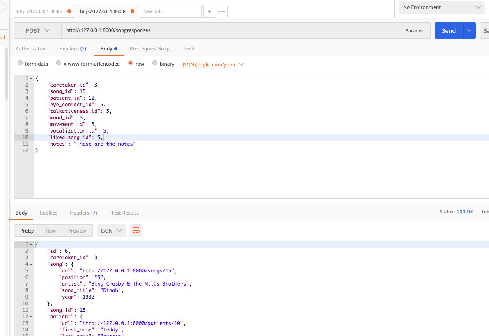
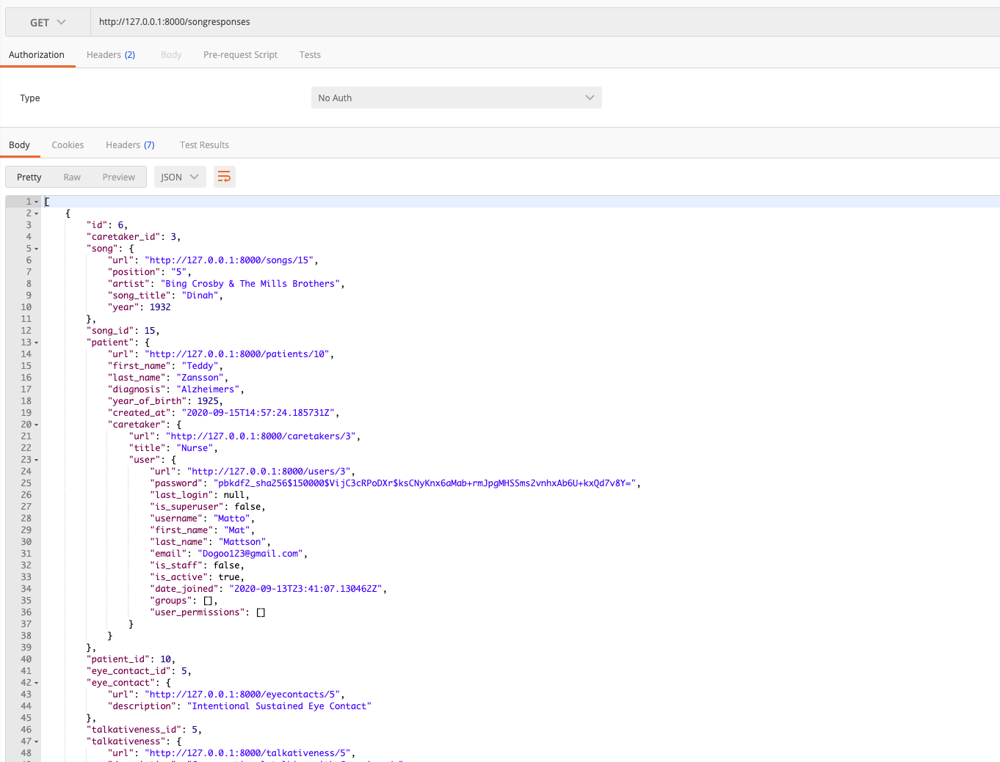
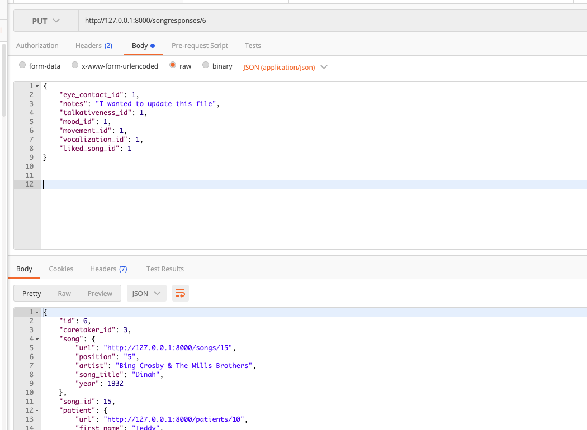

# Music Memory REST API

---

An Individual project Built using a Django REST Framework that ties to the [client-side application, Join Their Journey with Music 🎶 ](https://github.com/leigharobinson/jointheirjourney-withmusic) that helps caregivers interact, connect, and record standardized data on those suffering from dementia.

##### ERD


---

## Launching the Music Memory API

1. Create a new directory in your terminal of choice
1. Clone down the repository by clicking the "Clone or Download" button
1. In your terminal write: `git clone sshKeyGoesHere`
   conversion tool for writers.

---

Now, set up your virtual environment:

1. `python -m venv musicmemoryEnv`
1. Activate virtual environment:
   - **Mac**
     - `source ./ musicmemoryEnv/bin/activate`
   - **Windows** Maybe need to use Scripts
     - `source ./ musicmemoryEnv/Scripts/activate`
1. Install dependencies:
   `pip install -r requirements.txt`
1. Run migrations:
   `python manage.py migrate`
1. Create a superuser for your local version of the app:
   `python manage.py createsuperuser`
1. Now Run that Server!
   `python manage.py runserver`

---

# Testing in Postman

### Create Caretaker/User

- In Postman, Create a Caretaker/User by going to http://127.0.0.1:8000/register/ and make a **POST** request using

```{
"username": "TestUser",
"email":"TestUser123@gmail.com",
"password" :"123",
"first_name": "Test",
"last_name" : "Testerson",
"title": "Nurse"
}
```


- Take the Token and add it to Headers

  

- to **GET** caretaker you just created select git and go to http://127.0.0.1:8000/caretakers

- To **edit** caretaker go to http://127.0.0.1:8000/caretakers/(id of caretaker signed in) and select **PUT**
  

```
{
"title": "Music Therapist"
"first_name": "Molly",
"last_name": "Mollison",
"username": "Molly123"
}
```

---

### Patient

- Then make a patient. Go to http://127.0.0.1:8000/patients and make a **POST** request.
- If you need to remember the id your Caretaker got assigned on register, make a GET request to http://127.0.0.1:8000/caretakers
- In the Body add this information:

```
{
"first_name": "Bobby",
"last_name": "Bobberson",
"diagnosis": "Alzheimers",
"year_of_birth": "1925",
"caretaker_id":(whatever the id is from the caretaker you made)
}
```

- Then go to http://127.0.0.1:8000/patients and do a **GET** request and find out the patient id

- To edit select **PUT** and go to http://127.0.0.1:8000/patients/(id number of patient you want to edit)


```
{
"first_name": "Billy",
"last_name": "Billison",
"diagnosis": "Alzheimers",
"year_of_birth": "1935"
}
```

- To **DELETE** the Patient, http://127.0.0.1:8000/patients/(**patient id here**) and select **DELETE\*\*

---

### Song

####List:

- Now let's find out what songs were in the billboard top 5 your **patient** would've been 10-20 years old

- If you need to remember your patient's id , make a **GET** request to http://127.0.0.1:8000/patients

- go to http://127.0.0.1:8000/songs?patient_id=(your patient's id) and select **GET**, in the Body place this dummy data:


- Now let's find out what songs were in the billboard top 5 if you're not Logged into the app and you just quickly want to know what songs were in the top 5 billboard charts for a person born between any year from 1920-1970.
- go to http://127.0.0.1:8000/songs?birth_year=(yyyy) and select GET
  

---

### Song Response

- To Create a Patient's **Song Response** go to http://127.0.0.1:8000/songresponses and Select **POST**
- in the Body put this data:

```
  {
  "caretaker_id":(whatever the id is from the caretaker you made),
  "song_id": 15,
  "patient_id": (whatever the id is from the patient you made),
  "eye_contact_id": 5,
  "talkativeness_id": 5,
  "mood_id": 5,
  "movement_id": 5,
  "vocalization_id": 5,
  "liked_song_id": 5,
  "notes": "These are the notes"
  }
```

  

- To **GET** a Patient's **Song Response** go to http://127.0.0.1:8000/songresponses and Select **GET**
  

- You can edit/update **song response** by going to http://127.0.0.1:8000/songresponses/(id of song response in) and select **PUT**
- you can edit these fields :

```
  {
  "eye_contact_id": 1,
  "notes": "I wanted to update this file",
  "talkativeness_id": 1,
  "mood_id": 1,
  "movement_id": 1,
  "vocalization_id": 1,
  "liked_song_id": 1
  }
```

   

- To **DELETE** the Patient, http://127.0.0.1:8000/songresponses/(**put your song response id here**) and select **DELETE\*\*
